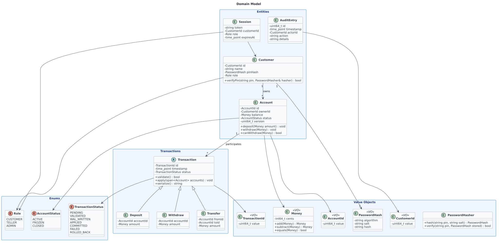
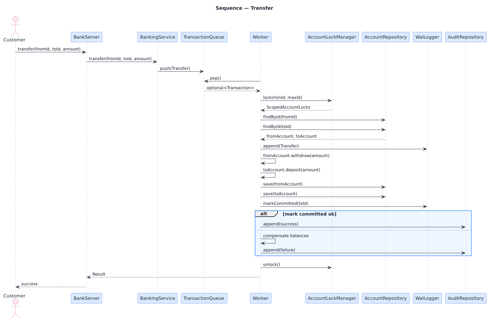
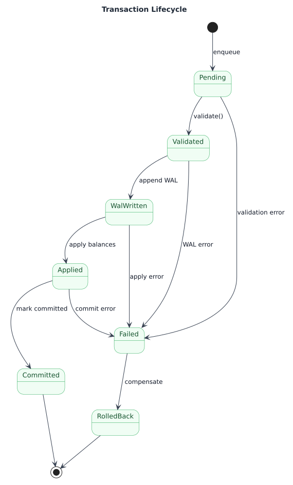
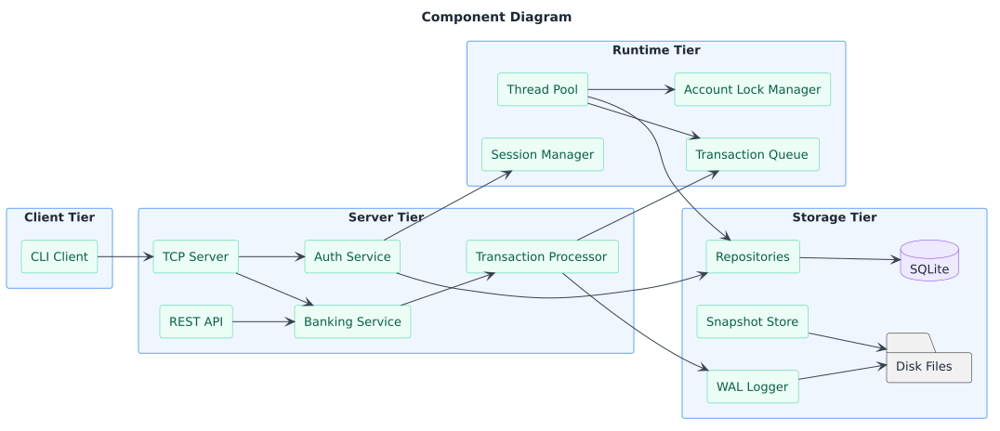

# Bank Management System

A C++20 concurrency-focused bank management system, built as a portfolio
project demonstrating layered architecture, per-account locking, WAL-based
durability, and modern C++ idioms.

## Status

- [x] UML design
- [x] CMake scaffold
- [x] Domain model
- [x] Persistence (WAL + snapshot)
- [x] Tests + sanitizers (ASan/UBSan, TSAN)
- [ ] Concurrency (thread pool, per-account locks)
- [ ] Auth + audit log
- [ ] API (TCP server + REST)
- [ ] Benchmarks
- [ ] CI

## Build & Run

    cmake --preset dev
    cmake --build --preset dev
    ctest --preset dev

Additional presets:

    cmake --preset tsan      # ThreadSanitizer, for the concurrency milestone
    cmake --preset release

Convenience target (configure, build, and run the full suite):

    cmake --build --preset dev --target check

## Project structure

    src/core/          - small shared utilities (Result, TimeUtil)
    src/domain/        - pure business rules (Money, Account, Transaction, ...)
    src/persistence/   - WAL, snapshot, repositories (in-memory + SQLite)
    tests/             - doctest suite
    docs/uml/          - design diagrams

## Architecture

Full diagram set: [`docs/uml/`](docs/uml/)

### Domain Model

### Transfer Sequence

### Transaction State Machine

### Component View

